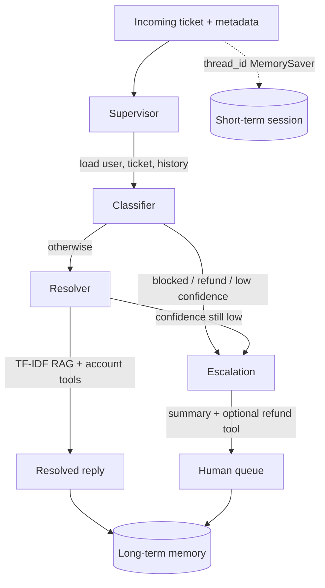

# UDA-Hub agent design

## Goal

UDA-Hub is a decision layer in front of CultPass support. It reads a ticket,
chooses a specialist path, answers from knowledge when confidence is high, and
escalates when policy or uncertainty requires a human.

## Graph (custom StateGraph, not the starter ReAct orchestrator)

## Agents

| Node | Responsibility |
| --- | --- |
| Supervisor | Parse the utterance, extract user id/email, call CultPass lookup and UDA-Hub ticket load |
| Classifier | Label issue type, urgency, confidence; apply routing rules |
| Resolver | RAG over knowledge, subscription/reservation tools, write a reply, store memory |
| Escalation | Human-readable summary, refund tool when requested, mark ticket `escalated` |

## Routing rules

Escalate immediately when any of these hold:

- CultPass `is_blocked` is true
- Issue type is `refund` or the member asked for money back
- Classifier confidence `< 0.55`
- Issue type is `unknown`

Otherwise send to Resolver. Resolver may still escalate if retrieved-article
confidence stays below `0.62` (for example persistent login after KB says to
escalate).

## Memory

- **Short-term:** `langgraph.checkpoint.memory.MemorySaver` keyed by `thread_id`
  (the ticket/session id passed to `chat_interface`).
- **Long-term:** `data/core/memory.db` rows of `{user_id, kind, text}`. Recall
  ranks rows with token overlap against the current ticket.

## Tools / MCP

Business logic lives in `agentic/tools/*_ops.py`. FastMCP servers in
`agentic/tools/mcp/` expose the same functions over stdio so DB access is not
tied to the notebook working directory. `langchain-mcp-adapters` can load those
servers; the graph also binds the functions directly for tests.

## Databases

1. `data/external/cultpass.db` — CultPass users, subscriptions, experiences, reservations
2. `data/core/udahub.db` — UDA-Hub accounts, tickets, knowledge articles
